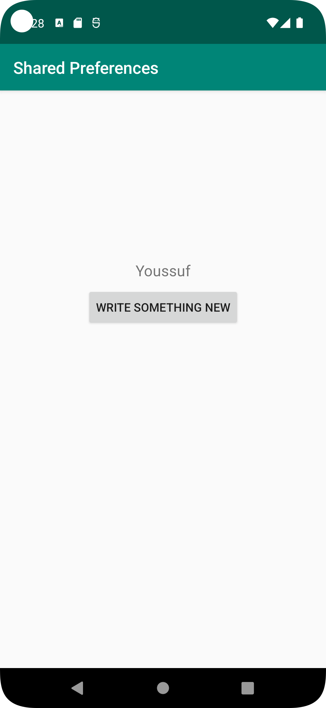
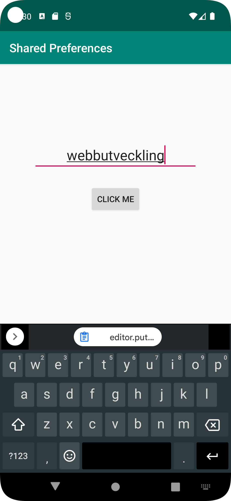

# Rapport
Purpose of this app's development was to create a button that takes user to the second activity, 
along with the saved string so it can be displayed. 
Then, an EditText would allow the user to input data that would be saved as a shared preference. 
This data that is saved as shared-preference would then be shown in the mainActivity.
The OnResume method lets the app save the string when app is shutdown and restarted. 
In other words, the same string would be displayed after restarting the application. 

```package com.example.project;

import androidx.appcompat.app.AppCompatActivity;

import android.content.SharedPreferences;
import android.os.Bundle;
import android.view.View;
import android.widget.Button;
import android.widget.EditText;

public class SecondActivity extends AppCompatActivity {
    private final String key = String.valueOf(R.string.inputData);
    private Button button;
    private SharedPreferences sharedPreferences;


    @Override
    protected void onCreate(Bundle savedInstanceState) {
        super.onCreate(savedInstanceState);
        setContentView(R.layout.activity_second);

        sharedPreferences = getSharedPreferences(key, MODE_PRIVATE);

        button = findViewById(R.id.secondButtonsave);
        button.setOnClickListener(new View.OnClickListener() {
            @Override
            public void onClick(View view) {
                retainData();
                finish();


            }
        });
    }


    private void retainData() {
        EditText userInputEditText = findViewById(R.id.showInput);
        String userInputData = userInputEditText.getText().toString();

    //    SharedPreferences sharedPreferences = getSharedPreferences("inputData", MODE_PRIVATE);
        SharedPreferences.Editor editor = sharedPreferences.edit();

        editor.putString(key, userInputData);
        String key = "sharedPreferences";

        editor.apply();
    }

}

```
```
 protected void onResume() {
        super.onResume();
        Log.d("onResume-b21youab", "Main activity active");
        String defaultValue = "Share something.";
         SharedPreferences sharedPref = getSharedPreferences(key, MODE_PRIVATE);
        sharedData.setText(sharedPref.getString(key, defaultValue));
    }

```
## Följande grundsyn gäller dugga-svar:

- Ett kortfattat svar är att föredra. Svar som är längre än en sida text (skärmdumpar och programkod exkluderat) är onödigt långt.
- Svaret skall ha minst en snutt programkod.
- Svaret skall inkludera en kort övergripande förklarande text som redogör för vad respektive snutt programkod gör eller som svarar på annan teorifråga.
- Svaret skall ha minst en skärmdump. Skärmdumpar skall illustrera exekvering av relevant programkod. Eventuell text i skärmdumpar måste vara läsbar.
- I de fall detta efterfrågas, dela upp delar av ditt svar i för- och nackdelar. Dina för- respektive nackdelar skall vara i form av punktlistor med kortare stycken (3-4 meningar).

Programkod ska se ut som exemplet nedan. Koden måste vara korrekt indenterad då den blir lättare att läsa vilket gör det lättare att hitta syntaktiska fel.

```
function errorCallback(error) {
    switch(error.code) {
        case error.PERMISSION_DENIED:
            // Geolocation API stöds inte, gör något
            break;
        case error.POSITION_UNAVAILABLE:
            // Misslyckat positionsanrop, gör något
            break;
        case error.UNKNOWN_ERROR:
            // Okänt fel, gör något
            break;
    }
}
```
```
<TextView
        android:id="@+id/nameTextView"
        android:layout_width="wrap_content"
        android:layout_height="wrap_content"
        android:text="@string/app_name"
        android:textSize="18sp"
        android:padding="8dp"
        app:layout_constraintBottom_toBottomOf="parent"
        app:layout_constraintEnd_toEndOf="parent"
        app:layout_constraintStart_toStartOf="parent"
        app:layout_constraintTop_toBottomOf="@+id/appBarLayout"
        app:layout_constraintVertical_bias="0.30" />

    <Button
        android:id="@+id/ActivityStartButton"
        android:layout_width="wrap_content"
        android:layout_height="wrap_content"
        android:text="write something new"
        app:layout_constraintTop_toBottomOf="@id/nameTextView"
        app:layout_constraintStart_toStartOf="@id/nameTextView"
        app:layout_constraintEnd_toEndOf="@id/nameTextView"/>

```
```

<EditText
        android:id="@+id/showInput"
        android:layout_width="wrap_content"
        android:layout_height="wrap_content"
        android:hint="@string/input"
        android:maxEms="20"
        android:minEms="10"
        android:textSize="24sp"
        android:gravity="center_horizontal"
        app:layout_constraintBottom_toBottomOf="parent"
        app:layout_constraintEnd_toEndOf="parent"
        app:layout_constraintStart_toStartOf="parent"
        app:layout_constraintTop_toTopOf="parent"
        app:layout_constraintVertical_bias="0.19999999" />

    <Button
        android:id="@+id/secondButtonsave"
        android:layout_width="wrap_content"
        android:layout_height="wrap_content"
        android:layout_marginTop="24dp"
        android:text="Click me"
        app:layout_constraintEnd_toEndOf="@+id/showInput"
        app:layout_constraintStart_toStartOf="@+id/showInput"
        app:layout_constraintTop_toBottomOf="@+id/showInput" />


```

Bilder läggs i samma mapp som markdown-filen.





Läs gärna:

- Boulos, M.N.K., Warren, J., Gong, J. & Yue, P. (2010) Web GIS in practice VIII: HTML5 and the canvas element for interactive online mapping. International journal of health geographics 9, 14. Shin, Y. &
- Wunsche, B.C. (2013) A smartphone-based golf simulation exercise game for supporting arthritis patients. 2013 28th International Conference of Image and Vision Computing New Zealand (IVCNZ), IEEE, pp. 459–464.
- Wohlin, C., Runeson, P., Höst, M., Ohlsson, M.C., Regnell, B., Wesslén, A. (2012) Experimentation in Software Engineering, Berlin, Heidelberg: Springer Berlin Heidelberg.
